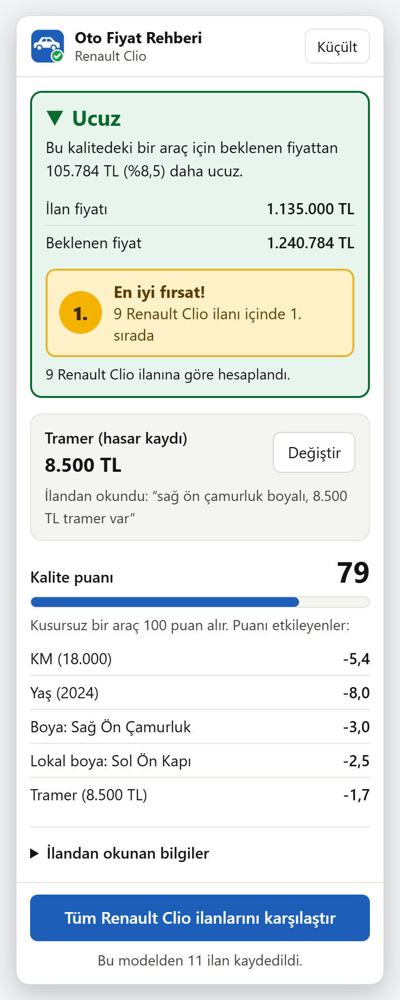
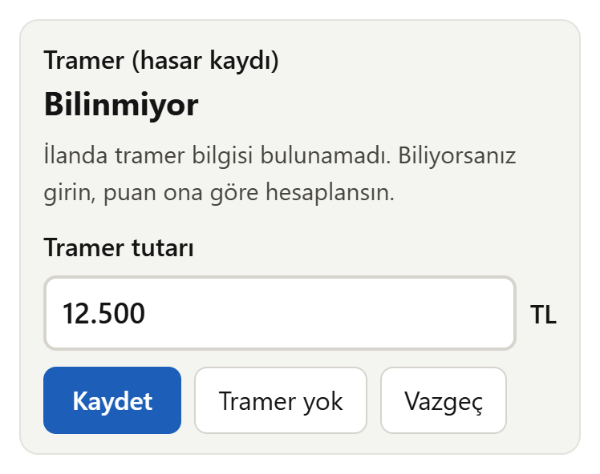
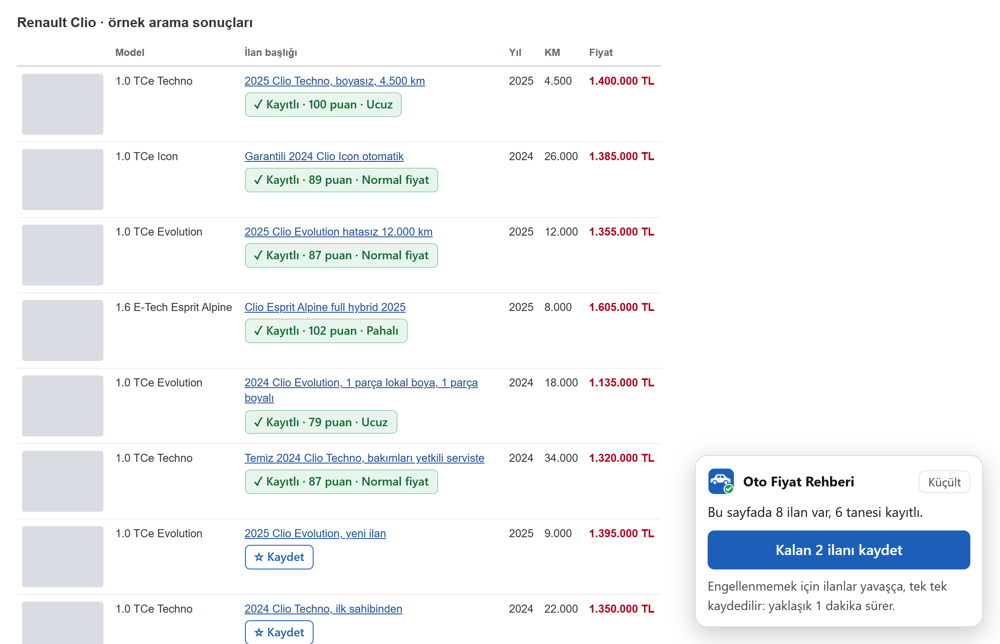
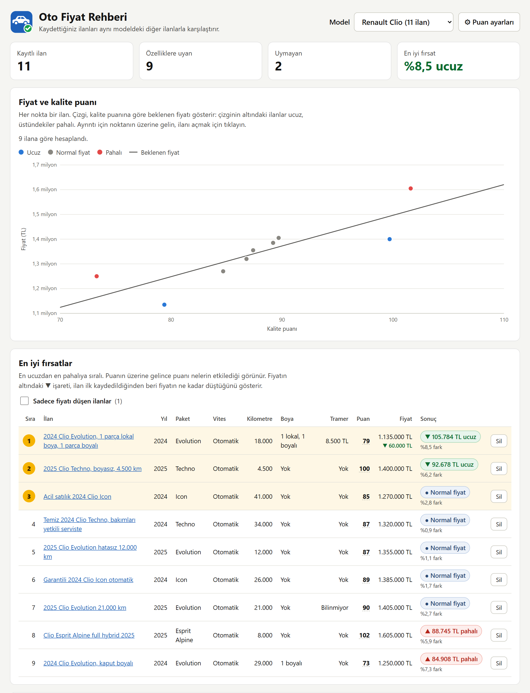
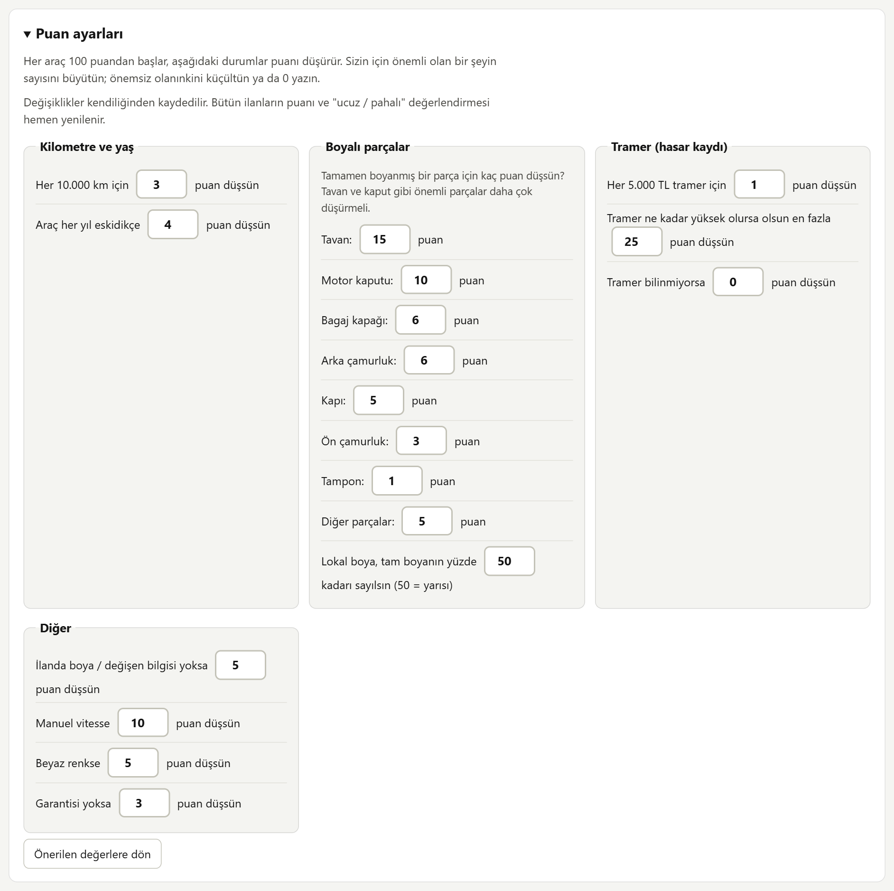

# Oto Fiyat Rehberi

> **Kişisel proje.** İkinci el araba ararken sahibinden.com ilanlarını değerlendirmek için kendi
> kullanımıma yazdığım bir Chrome eklentisi. sahibinden.com ile herhangi bir bağlantısı yoktur,
> Chrome Web Store'da yayında değildir; destek ya da güncelleme sözü verilmez.

Arayüz, teknik bilgisi olmayan biri de rahatça kullanabilsin diye sade Türkçe ve büyük yazıyla hazırlandı.

## Ne yapar?

- sahibinden.com'da açtığınız her araba ilanına **kalite puanı** verir: kilometre, yaş, boyalı ve
  değişen parçalar (hangi parça olduğuna göre), tramer, vites, renk ve garanti.
- Aynı modelden kaydedilen ilanlara bakarak fiyatın, aracın puanına göre **ucuz, normal ya da pahalı**
  olduğunu söyler.
- Arama sonuçlarındaki ilanları **açmadan, tek tıkla kaydeder**.
- Kaydedilen bütün ilanları model model karşılaştıran bir sayfa sunar.

## Ekran görüntüleri

Görüntülerdeki ilanların hepsi örnek veridir.

### İlan sayfasındaki panel

İlan açılınca sağ alt köşede çıkar. En üstte sonuç, altında tramer bilgisi ve puanı nelerin düşürdüğü görünür.

Tramer ilanda yazmıyorsa ya da yanlışsa panelden girilebilir. Girilen değer ilan tekrar açıldığında da korunur.

### Arama sonuçları

Sağ alttaki kutu sayfadaki bütün ilanları tek seferde kaydeder. Her ilanın altında da kendi düğmesi
vardır; kaydedilen ilanın puanı ve sonucu orada görünür.

### Karşılaştırma sayfası

Seçilen modeldeki ilanlar grafikte ve en iyi fırsattan başlayan bir tabloda gösterilir. Çizgi,
puanına göre beklenen fiyattır; çizginin altındaki ilanlar ucuzdur.

### Puan ayarları

Hangi kusurun kaç puan düşüreceği karşılaştırma sayfasından değiştirilebilir.

## Nasıl çalışır?

**Puan.** Her araç 100 puandan başlar, kusurlar puanı düşürür. Örneğin her 10.000 km için 3 puan,
her yaş için 4 puan düşer. Boyalı tavan 15, boyalı kaput 10, boyalı ön çamurluk 3 puan düşürür;
lokal boya bunun yarısı sayılır. Bütün değerler değiştirilebilir (bkz. [Puan ayarları](#puan-ayarları)).

**Fiyat.** Aynı modeldeki uygun ilanlar için düz bir çizgi oturtulur:
`fiyat = eğim × puan + sabit` (`cheapest-nft/charting.py` ile aynı yaklaşım). Çizginin altında kalan
ilan, puanına göre ucuzdur. Beklenen fiyatın ±%3'ü içindeki ilanlar "normal fiyat" sayılır. Çizgi
için o modelden en az 5 uygun ilan gerekir.

**Modeller ayrı tutulur.** İlanlar sahibinden'deki "Marka Seri" bilgisine göre gruplanır
("Renault Clio", "Hyundai i20" gibi) ve farklı modeller birbiriyle kıyaslanmaz. Modele özel ayarlar
(izin verilen paketler, paket puanları, en düşük model yılı) `src/lib/config.js` içinde tanımlanır.

**Tramer.** İlanda tutar yazıyorsa o kullanılır. Yazmıyorsa "tramer kaydı yok", "hasar kayıtsız",
"hatasız" ya da "boyasız" gibi ifadelerden 0 kabul edilir. Panelden elle de girilebilir.

**Kategoriler.** Otomobil ile Arazi, SUV & Pickup kategorilerindeki ilanlar desteklenir.

**Veriler.** Her şey tarayıcının kendi deposunda (`chrome.storage.local`) saklanır, hiçbir yere gönderilmez.

## Kurulum

Eklenti Chrome'a "paketlenmemiş öğe" olarak yüklenir:

1. Repoyu indirin (`git clone` ya da GitHub'da **Code → Download ZIP**) ve kalıcı bir klasöre koyun, örneğin `C:\OtoFiyatRehberi`.
2. Chrome'da `chrome://extensions` adresini açın ve sağ üstten **Geliştirici modu**'nu açın.
3. **Paketlenmemiş öğe yükle**'ye basıp klasörü seçin.
4. Araç çubuğundaki yapboz simgesinden eklentiyi sabitleyin.

Dikkat edilecekler:

- **Klasörün yerini değiştirmeyin, eklentiyi kaldırmayın.** Chrome kaydedilen ilanları ve ayarları
  klasörün yoluna bağlı tutar; yol değişirse ya da eklenti kaldırılırsa hepsi kaybolur.
- **Geliştirici modunu kapatmayın**, kapatılırsa eklenti devre dışı kalır.
- **Güncelleme:** yeni dosyaları aynı klasöre kopyalayın, sonra `chrome://extensions` sayfasında eklentinin ⟳ simgesine basın.

## Kullanım

- **İlan sayfası:** Bir araba ilanı açtığınızda panel kendiliğinden çıkar ve ilan kaydedilir.
- **Arama sonuçları:** Sağ alttaki kutudan **Hepsini kaydet**'e basın. sahibinden hızlı istek
  yapanları engellediği için ilanlar arka planda tek tek, aralarında rastgele 10–20 saniye beklenerek
  indirilir; 20 ilanlık bir sayfa yaklaşık 5 dakika sürer ve bu sırada sayfa açık kalmalıdır. Birden
  fazla sekmede basılsa da istekler tek sıradan geçer. sahibinden engellemeye başlarsa (403/429,
  doğrulama sayfası ya da ilan dışı bir sayfaya yönlendirme) kayıt durur ve 60 dakika boyunca kapalı
  kalır; ilan olmayan bir sayfa gelirse de güvenlik için durur. Bu süreler `config.js` içindeki
  `fetching` bölümünden değiştirilebilir.
- **Karşılaştırma sayfası:** Araç çubuğundaki simgeye tıklayıp **Kaydedilen ilanları karşılaştır**'a
  ya da paneldeki mavi düğmeye basın.
- **Puan ayarları:** Karşılaştırma sayfasında **⚙ Puan ayarları**. Değişiklikler kendiliğinden kaydedilir.
- **Yedekleme:** Karşılaştırma sayfasının altındaki **Yedekleme** bölümünden bütün ilanlar dosyaya
  alınabilir ve başka bir bilgisayara yüklenebilir. Puan ayarları yedeğe dahil değildir.

## Geliştirme

### Dosyalar

- `manifest.json`: eklenti tanımı. Görünen ad yalnızca burada (`name`); panel, popup ve karşılaştırma sayfası adı buradan okur.
- `src/lib/config.js`: önerilen puan ağırlıkları, filtreler ve model profilleri (`models`).
- `src/lib/scoring.js`: bir ilanın filtreleri ve puan dökümü, model gruplama, ayarların birleştirilmesi.
- `src/lib/regression.js`: en küçük kareler çizgisi, beklenen fiyat ve ucuz/normal/pahalı kararı.
- `src/lib/storage.js`: ilanlar, elle girilen değerler ve kullanıcı ayarları.
- `src/content/parser.js`: ilan sayfasını okur (bilgi tablosu, fiyat, boya/değişen şeması, tramer). Desteklenen kategoriler `SCC.CAR_CATEGORIES`.
- `src/content/panel.js`, `content.js`: ilan sayfasındaki panel.
- `src/content/results.js`: arama sonuçlarındaki düğmeler ve "Hepsini kaydet" kutusu.
- `dashboard/`: karşılaştırma sayfası (grafik, tablolar, `settings.js` ile puan ayarları formu).
- `popup/`: araç çubuğu simgesine tıklayınca açılan küçük pencere.
- `icons/logo.svg`: logo. `icon-*.png` dosyaları bundan üretildi; sahibinden sayfalarındaki arayüz `src/lib/logo.js` içindeki aynı çizimi kullanır.

### Notlar

- **Ayarlar:** `config.js` önerilen değerleri tutar. Puan ayarları formu yalnızca bunlardan farklı
  olan değerleri kaydeder (`chrome.storage.local` → `settings`) ve her sayfa bunları `config.js`'in
  üzerine bindirir (`SCC.storage.loadSettings()`). Böylece `config.js`'te sonradan yapılan
  değişiklikler, kullanıcının dokunmadığı ayarlara yine ulaşır.
- **Ham veri:** İlanlar okunduğu haliyle saklanır, puanlar her açılışta yeniden hesaplanır. `config.js`
  ya da ayarlar değişince kayıtlı bütün ilanlar yeniden puanlanır.
- **Elle girilen değerler** (şimdilik yalnızca tramer) `listing.overrides` içinde durur ve ilan
  tekrar okunsa da sayfadan okunanın önüne geçer.
- **Kategoriler:** `SCC.CAR_CATEGORIES` (`parser.js`) ile `manifest.json`'daki ilk içerik betiğinin
  `matches` listesi aynı tutulmalı.
- **Parser sahibinden'in HTML'ine bağlıdır.** Sayfa yapısı değişince alanlar boş gelir ve panel
  "Bu ilan okunamadı" der. **Sayfayı kaydet** düğmesiyle sayfanın HTML'ini alıp `fixtures/` klasörüne
  koyun ve parser'ı ona göre düzeltin. Bu dosyalar git'e girmez: oturum açıkken kaydedilen sayfalarda
  hesap adı, ilanlarda satıcı telefonları bulunur.
- **Kodu değiştirdikten sonra** `chrome://extensions` sayfasında ⟳ simgesine basın ve sahibinden sekmesini yenileyin.
